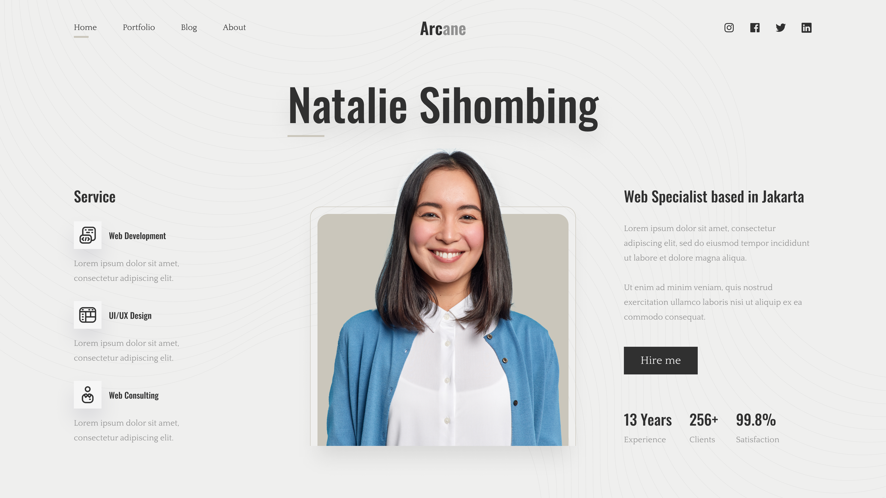

  

---

This project showcases my experience in using HTML and CSS, incorporating Sass to improve code efficiency, organization, and maintainability. The design focuses on a header specifically created for a personal portfolio, optimized to adapt to screens up to 1200px wide, ensuring a visually appealing and functional experience.

## 📁 Repository Structure

The repository includes a functional header with links to various sections, designed to enhance the presentation of a personal portfolio. The following technologies are utilized in this project:

| Tecnología | Enlace |
|------------|--------|
| **HTML**   | |
| **CSS**    |   |
| **SASS**   | |

---

<h2 align="center">
  Header: Personal Portfolio 
</h2>

 

## 🛠️ Resources Used

🌐 Google Fonts:

- Oswald: A modern and compact sans-serif font, ideal for headings and screens, offering excellent readability in large sizes.
- Quattrocento: A classic and elegant serif font, designed for clear and comfortable reading in long texts.

## Contributions 🤝

Your participation is valuable! If you have ideas, improvements, or find any issues, feel free to:

- Open issues to report bugs or suggest improvements.
- Create pull requests to propose changes directly.
- Share your feedback and experiences to help refine these examples.

Every contribution counts towards building together. 🌟

## Professional Services 💼

I am available to work on web design projects, whether for individuals or businesses. Do you have a project in mind, or need assistance with your website?

Let’s talk and bring your digital vision to life! 🚀
 

## Licencia 📜

This project is licensed under the  [MIT] - Check the [LICENSE](LICENSE) file for more details.

---

  

---

Este proyecto demuestra mi experiencia en el uso de HTML y CSS, incorporando Sass para mejorar la eficiencia, organización y mantenimiento del código. El diseño está centrado en un header diseñado específicamente para un portafolio personal, con una optimización para adaptarse a pantallas de hasta 1200px de ancho, garantizando una experiencia visualmente atractiva y funcional.

## 📁 Contenido del Repositorio

El repositorio contiene un header funcional con enlaces a diferentes secciones, diseñado para realzar la presentación de un portafolio personal. En este proyecto se emplean las siguientes tecnologías:

| Tecnología | Enlace |
|------------|--------|
| **HTML**   | |
| **CSS**    |   |
| **SASS**   | |

---

<h2 align="center">
  Header: Personal Portfolio 
</h2>

 

## 🛠️ Recursos Utilizados

🌐 Google Fonts:

- Oswald: Tipografía sans serif con un diseño moderno y compacto, ideal para encabezados y pantallas, que ofrece excelente legibilidad en tamaños grandes.
- Quattrocento: Tipografía con serifa, de estilo clásico y elegante, diseñada para una lectura clara y cómoda en textos largos.

## Contribuciones 🤝

¡Tu participación es valiosa! Si tienes ideas, mejoras o encuentras algún problema, siéntete libre de:

Abrir issues para reportar errores o sugerir mejoras.
Realizar pull requests para proponer cambios directamente.
Compartir tus comentarios y experiencias para ayudar a perfeccionar estos ejemplos.
Cada aportación cuenta para seguir construyendo juntos. 🌟

## Servicios Profesionales 💼

Estoy disponible para trabajar en proyectos de diseño web, ya sea para particulares o empresas. ¿Tienes un proyecto en mente o necesitas asistencia con tu sitio web?

¡Hablemos y hagamos realidad tu visión digital! 🚀
 

## Licencia 📜

Este proyecto está bajo la licencia [MIT] - Consulta el archivo [LICENSE](LICENSE) para más detalles.

